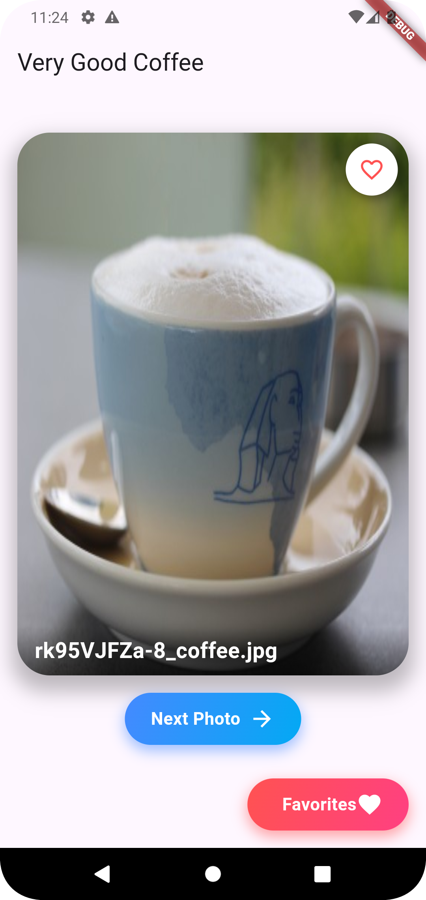

# Very Good Coffee App

A Flutter application that allows users to save their favorite coffee pictures. This project demonstrates good coding practices, clear architecture, and user-centric features.

## Project Summary

The goal of this project is to create a Flutter application that gives the user the ability to save their favorite coffee pictures. This is treated as a real-world client project, showcasing your expertise in building a well-designed and functional app. Feel free to use any third-party packages as needed. The project should meet all requirements outlined in this document to the best of your ability.

### User Requirements

As a user, you should be able to:

1. Open the app and load a new coffee image from the network.
2. Load a new coffee image if the current one is not your favorite.
3. Save the current coffee image locally if you really like it, so you can access your favorite coffee images at any time, even without internet access.
4. Properly handle any loading/error states to ensure a smooth user experience.

### Technical Requirements

- The application should pull the coffee images from the free API: [https://coffee.alexflipnote.dev](https://coffee.alexflipnote.dev).
- It should run on both iOS and Android devices.
- There should be clear instructions for how to run the application in the README file.

### Screenshots

- 
- 
## How to Run the Application

### Prerequisites

- Flutter SDK
- Dart SDK
- Android Studio / Xcode (for Android/iOS development)
- A compatible device or emulator
